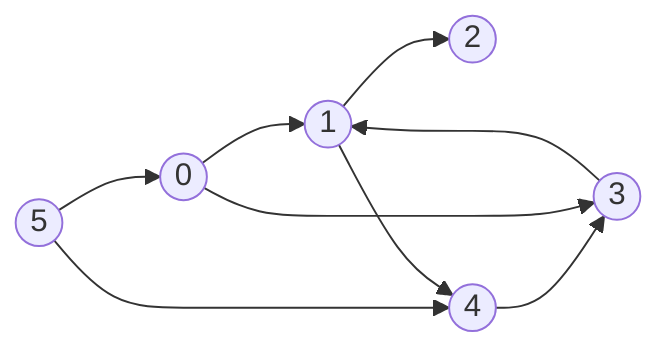

# Graph Attention: A Toy Transformer "Communicate Phase"

This project is a minimal, from-scratch implementation of the **attention mechanism** that
powers the Transformer's "communicate phase" — the step where nodes in a graph exchange
information with one another using **query / key / value** vectors, instead of fixed
weights like a standard graph neural network.

It's built to make the mechanics concrete: no frameworks, no autograd, just NumPy and a
handful of nodes passing messages along edges.

---

## The Big Idea

In the communicate phase of a Transformer:

- Every **head** applies the same attention operation, in **parallel**.
- Every **layer** applies attention in **series**, each with its own (different) weights.
- Nodes only communicate along the edges of a graph — in a decoder, "left-to-right"
  causal edges; in an encoder-decoder, the decoder also attends fully to encoder positions.

This repo implements the core primitive underneath all of that: **one round of
attention-based communication over an arbitrary directed graph.**

### Example graph

The classic illustration is a small directed graph like the one below — 6 nodes, edges
pointing every which way, some of them crossing:



Each node only "hears" from the nodes that have an edge pointing **into** it. Node `1`,
for example, receives messages from nodes `0` and `3`. Node `2` receives only from `1`.
This is exactly the structure `Graph.run()` below operates on — except instead of 6 nodes
and a hand-drawn graph, the code uses 10 nodes and 40 randomly generated directed edges.

---

## How the Code Works

### `Node`

Each `Node` holds:

- `data` — a 20-dimensional vector representing "what this node currently knows."
- `wkey`, `wquery`, `wvalue` — three separate 20×20 weight matrices.

From these, a node can produce three different projections of itself:

| Method    | Question it answers                          |
|-----------|-----------------------------------------------|
| `key()`   | "What do I have to offer?"                    |
| `query()` | "What am I looking for from my neighbors?"    |
| `value()` | "What do I actually broadcast if selected?"   |

This key/query/value split is the heart of attention: a node's *query* is compared
against every incoming neighbor's *key* to decide **how much** to listen to them, and
then their *value* vectors are combined accordingly.

### `Graph`

- Builds 10 `Node` objects.
- Builds 40 random directed edges `[from, to]`.
- `run()` performs **one communicate phase** across the whole graph:

For every node `i`:

1. Compute its `query` — what it's looking for.
2. Find all incoming edges `ifrom -> i` and gather those source nodes as `inputs`.
3. Compute each input node's `key`.
4. Score each input by the dot product of `key . query` — this measures compatibility
   between what the neighbor offers and what node `i` wants.
5. Exponentiate the scores (an un-normalized softmax numerator — note this
   implementation skips dividing by the sum, so scores are weights, not a true
   probability distribution).
6. Compute each input node's `value`, and combine them as a weighted sum using the
   scores.
7. Store this weighted sum as the node's `update`.

After every node's update is computed, they're all applied at once as a **residual
connection**:

```python
n.data = n.data + u
```

i.e. each node's new state is its old state *plus* whatever it gathered from its
neighbors — mirroring the `Add & Norm` residual connections seen in the Transformer
diagram (minus the normalization step).

### Encoder vs. Decoder, in graph terms

The same `run()` logic generalizes to the two halves of the Transformer:

- **Encoder** — a *fully-connected cluster*: every position attends to every other
  position (and itself), no masking.
- **Decoder** — attends fully to *encoder* positions (cross-attention), and is
  *left-to-right connected* among its own positions (causal self-attention): position
  `i` may only see positions `<= i`.

Swapping which edges exist in `self.edges` is all it takes to turn this generic graph
attention into an encoder, a decoder, or the toy 6-node example above.

---

## Running It

```bash
python attention.py
```

The script will:

1. Build a graph of 10 nodes and 40 random edges.
2. Print the graph size and Node 0's initial 20-dim vector.
3. Run one communicate phase, printing per-node diagnostics:
   - number of incoming edges
   - raw attention scores
   - sum of scores (not normalized to 1, since there's no softmax denominator)
   - shape of the computed update
4. Print Node 0's vector after the update, and confirm that every node's data changed
   (unless a node happened to have zero incoming edges).

---

## Notes / Things to Try Next

- **Normalize the scores** by dividing by their sum to get a true softmax — right now
  `scores = np.exp(scores)` is only the numerator.
- **Stack multiple layers**, each with fresh `wkey`/`wquery`/`wvalue` weights, to mimic
  the "series" part of the communicate phase.
- **Add multiple heads** per layer (several independent key/query/value projections
  computed in parallel, then combined) to mimic the "parallel" part.
- **Swap in a fixed edge list** (e.g. the encoder/decoder structure) instead of random
  edges to see how attention behaves under a real Transformer topology.
